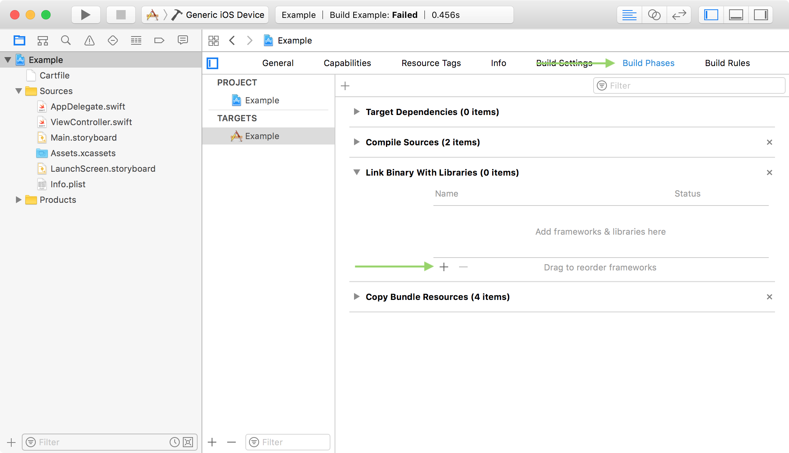
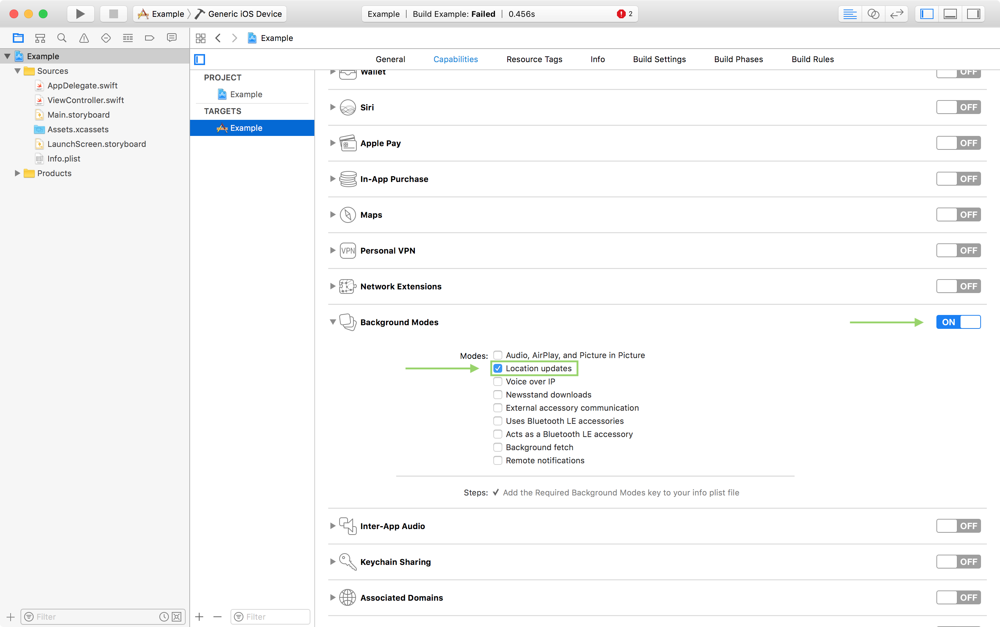
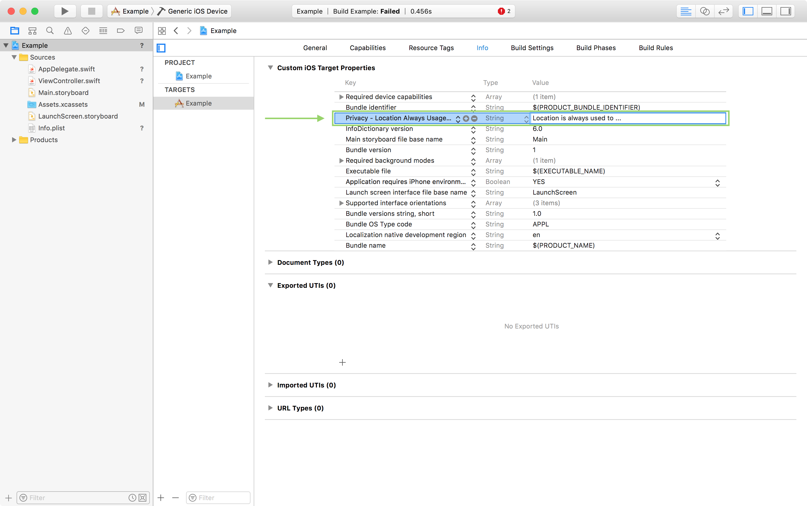

# Getting Started

## Requirements

* iOS 8.0+
* Xcode 8.3.3 or Xcode 9.0
* Register for a [predict.io API key](http://www.predict.io/service/registration/?level=1)

## Installation (CocoaPods)

Installation via CocoaPods can be accomplished by adding one of the following to your `Podfile`:

```ruby
# Always latest versions (Swift 4.0/3.2 & Xcode 9.0)
pod 'PredictIO', git: "git@github.com:predict-io/PredictIO-iOS.git", branch: "sdk5"

# Swift 4.0/3.2 & Xcode 9.0
pod 'PredictIO/Swift4.0', git: "git@github.com:predict-io/PredictIO-iOS.git", branch: "sdk5"

# Swift 3.1 & Xcode 8.3.3
pod 'PredictIO/Swift3.1', git: "git@github.com:predict-io/PredictIO-iOS.git", branch: "sdk5"
```

> **NOTE**: Only choose one of the options above!

## Installation (Carthage)

Add this to your `Cartfile`:

```
github "predict-io/PredictIO-iOS" "sdk5"
```

> **NOTE** It's important that you set the branch to `sdk5` in your `Cartfile`

```
$ carthage update --platform iOS  --cache-builds
```

### Link Binary with Libraries

Link your app with the following _System Frameworks_:

* `Accelerate.framework`
* `AdSupport.framework`
* `CoreLocation.framework`
* `CoreMotion.framework`
* `Foundation.framework`
* `SystemConfiguration.framework`
* `libz.tbd`



Once you've run the previous Carthage command you can add the SDK and its dependencies to your app also:

1. `PredictIO.framework`
2. `Alamofire.framework`
3. `Moya.framework`
4. `Reachability.framework`
5. `Realm.framework`
6. `RealmSwift.framework`
7. `Result.framework`
8. `RxCocoa.framework`
9. `RxSwift.framework`
10. `RxSwiftExt.framework`
11. `RxCoreMotion.framework`
12. `SwiftyJSON.framework`
13. `SwiftyUserDefaults.framework`


### Add 'Copy Frameworks' Build Phase

Create a _'New Run Script Phase'_ with the following contents:

```
/usr/local/bin/carthage copy-frameworks
```


Under *Input Files* add an entry for each of the following items:

1. `$(SRCROOT)/Carthage/Build/iOS/PredictIO.framework`
2. `$(SRCROOT)/Carthage/Build/iOS/Alamofire.framework`
3. `$(SRCROOT)/Carthage/Build/iOS/Moya.framework`
4. `$(SRCROOT)/Carthage/Build/iOS/Reachability.framework`
5. `$(SRCROOT)/Carthage/Build/iOS/Realm.framework`
6. `$(SRCROOT)/Carthage/Build/iOS/RealmSwift.framework`
7. `$(SRCROOT)/Carthage/Build/iOS/Result.framework`
8. `$(SRCROOT)/Carthage/Build/iOS/RxCocoa.framework`
9. `$(SRCROOT)/Carthage/Build/iOS/RxSwift.framework`
10. `$(SRCROOT)/Carthage/Build/iOS/RxSwiftExt.framework`
11. `$(SRCROOT)/Carthage/Build/iOS/RxCoreMotion.framework`
12. `$(SRCROOT)/Carthage/Build/iOS/SwiftyJSON.framework`
13. `$(SRCROOT)/Carthage/Build/iOS/SwiftyUserDefaults.framework`

# Usage

## Configure your project

### 1. Enable Background Location Updates

Location is used efficiently while in the background, having minimal effect on battery usage. To enable _Background Location Updates_ open your Project Settings, select your App Target, choose _Capabilities_, enable _Background Modes_ and check _Location updates_.



> **NOTE** You are required to handle the location permissions request in your application with your own implementation.

### 2. App Usage Descriptions to `Info.plist`

iOS requires you provide the user with a meaningful description of why you will be using their location. It's required that you add the following to your `Info.plist`:

* **Privacy - Location Always Usage Description** (`NSLocationAlwaysUsageDescription`)
* For iOS 11+ **Privacy - Location Always and When In Use Usage Description** (`NSLocationAlwaysAndWhenInUseUsageDescription`)



## Integrate the SDK

```swift
import PredictIO

let apiKey = "<YOUR_API_KEY>"

PredictIO.instance.start(apiKey) {
  (error: PredictIOError?) in
  
  if let error = error {
    print("Error starting PredictIO SDK => \(error)")  
  }
    
  switch error {
    case .invalidKey?:
    // Your API key is invalid (incorrect or deactivated)
    break

    case .killSwitch?:
    // Kill switch has been enabled to stop the SDK
    break

    case .wifiDisabled?:
    // User has WiFi turned off significantly impacting location accuracy available.
    // This may result in missed events!
    // NOTE: SDK still launches after this error!
    break

    case nil:
    // No error, SDK started with no problems
    print("Successfully started PredictIO SDK!") 
    break
  }
}
```

# Support

Visit our [Help Center]([https://support.predict.io](https://support.predict.io/)), open an Issue or send an email to [support@predict.io](support@predict.io).
